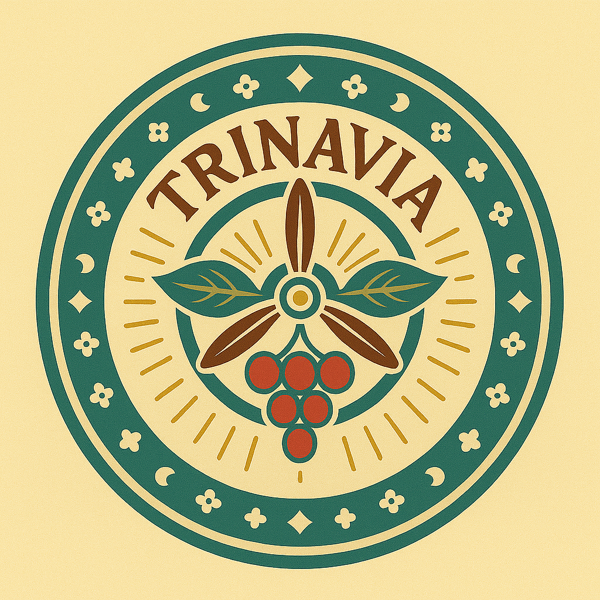
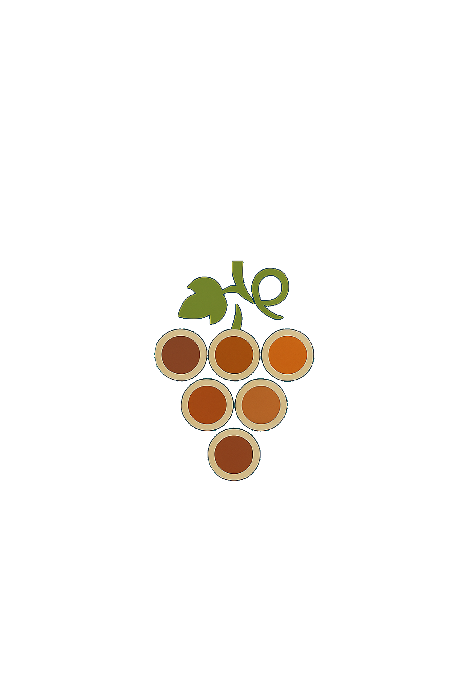
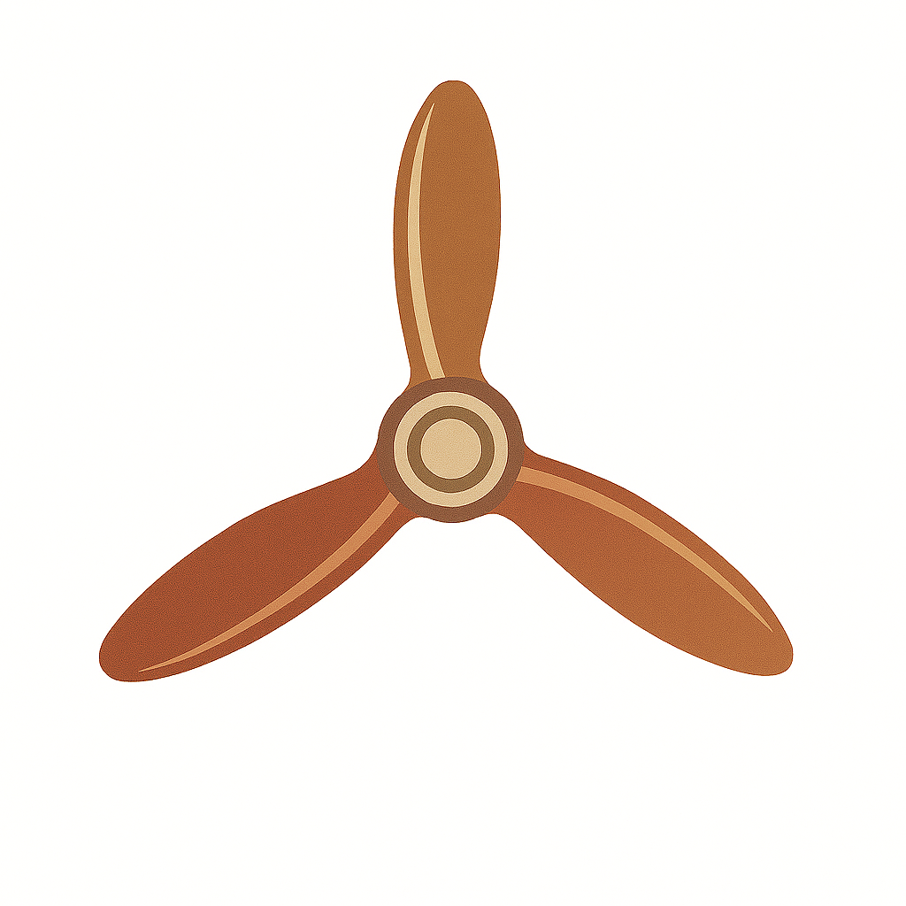

<div align="center">

# Trinavia

**Precision Agriculture Solutions for Viticulture**

<table>
<tr>
<td align="center" width="25%">

</td>
<td align="center" width="25%">

</td>
<td align="center" width="25%">

</td>
<td align="center" width="25%">

</td>
</tr>
</table>


</div>

Trinavia is a comprehensive platform for vineyard-specialized drone technology, combining cutting-edge precision agriculture with the sophistication of modern winemaking. Our solution provides vineyard operators with advanced data collection, analysis, and monitoring capabilities through drone-based systems.

## Active Projects

### 🛫 Moose UAV Build Project

We are currently developing a 3D-printed fixed-wing UAV platform as a foundational step toward building custom agricultural drones. This project encompasses:

- **Hardware Integration**: Flight controllers, GPS, telemetry systems, and sensor payloads
- **3D Modeling & Manufacturing**: CAD design, additive manufacturing, and material optimization
- **Autonomous Systems**: Flight control algorithms and automated mission planning
- **Sensor Development**: Integration of RGB, spectral, thermal, and LiDAR sensors for agricultural data collection

<table>
<tr>
<td align="center" width="33%">

</td>
<td align="center" width="33%">

</td>
<td align="center" width="33%">

</td>
</tr>
</table>

**Status**: Project Airborne - Final Assembly & Integration  
**Learn More**: [Moose Build Process Documentation](docs/Moose%20build%20process/README.md)

## Features

- **Drone-Based Monitoring**: Advanced UAV systems for vineyard surveillance and data collection
- **Precision Agriculture Analytics**: Real-time crop health assessment and yield prediction
- **Water Stress Management**: Comprehensive irrigation optimization using thermal imaging
- **Disease Detection**: Early identification of vine diseases through computer vision
- **Data-Driven Insights**: Integration of multiple data sources for informed decision making

## Project Status

- **Design**: In development (Brand assets and UI mockups complete)
- **Research**: Comprehensive viticulture and drone technology research completed
- **Hardware Development**: Active UAV development and prototyping (see [Moose Build Process](docs/Moose%20build%20process/README.md))
- **Development**: Platform architecture and implementation in progress
- **Mobile & Web**: Cross-platform development planned

## Repository Structure

> **Note**: Some large files (presentations, high-resolution assets, and research papers >25MB) are excluded from this repository due to GitHub file size limitations. The complete project assets are available upon collaboration request.

This repository contains the complete Trinavia project ecosystem:

```
Trinavia/
├── design/           # Brand and visual assets
│   ├── brand-assets/ # Logos, patterns, and brand elements
│   ├── mockups/      # UI/UX design mockups and stylescapes
│   └── presentations/# Brand presentation materials
├── docs/             # Documentation and research
│   ├── drafts/       # Content drafts and specifications
│   ├── Moose build process/ # 3D-printed UAV development project
│   └── Research Papers/ # Academic research on precision agriculture
├── src/              # Source code
│   ├── mobile/       # Mobile application development
│   └── web/          # Web platform development
└── tools/            # Development tools and utilities
```

### Key Directories

- **`/design`**: Complete brand identity, UI mockups, and visual assets for the platform
- **`/docs`**: Comprehensive research documentation including academic papers on drone technology, precision agriculture, and viticulture applications
  - **`/docs/Moose build process`**: Active hardware development project documenting the construction of a 3D-printed fixed-wing UAV as a foundational step toward autonomous agricultural systems
- **`/src`**: Development source code for both web and mobile platforms
- **`/tools`**: Development utilities and build tools

## Technology Stack

### Software & Platform
- **Web Platform**: Modern responsive design
- **Mobile Applications**: Cross-platform development
- **Data Analytics**: Computer vision and machine learning integration

### Hardware & UAV Systems
- **Flight Control**: ArduPilot/PX4 autonomous flight systems
- **Sensor Integration**: RGB, multispectral, thermal, and LiDAR sensors
- **Manufacturing**: 3D printing (LW-PLA, PC/PETG) and composite materials
- **Electronics**: Flight controllers, GPS modules, telemetry systems, motor controllers

## Contact

For collaboration opportunities, partnership inquiries, or technical discussions, please reach out to discuss how you can contribute to advancing precision agriculture in viticulture.

## License

This project is proprietary. See [LICENSE](LICENSE) for usage restrictions and collaboration guidelines.